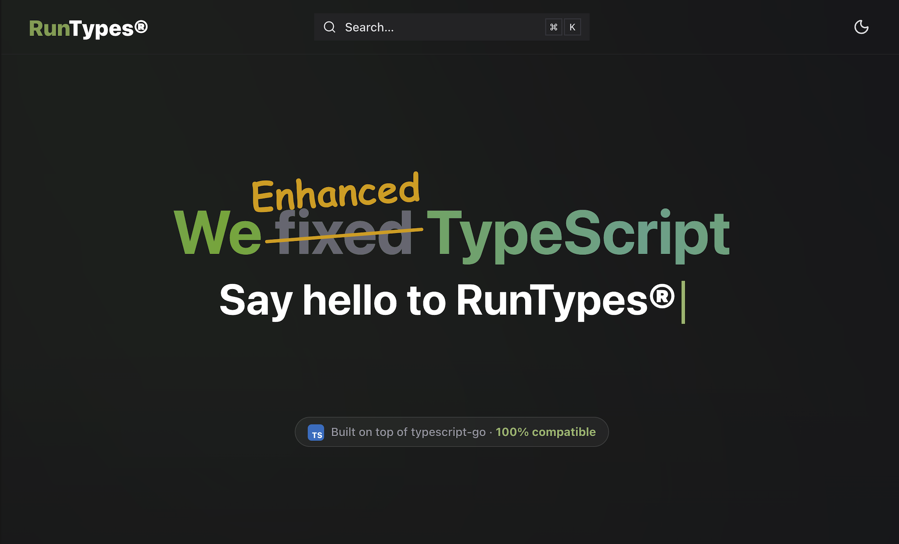

# RunTypes

**Compile-time runtime types for TypeScript 7 / typescript-go (tsgo).**

TypeScript throws your types away before your code ever runs. RunTypes reads them
first, at build time, and hands the runtime back what it lost: validators, JSON and
binary (de)serializers, mock data, and reflection.

A native Go binary reaches into the real tsgo type checker and answers call-site
type queries; a cross-bundler plugin rewrites each marked call and emits
deduplicated, tree-shakeable type-metadata modules. Your types _are_ the schema, so
there is no second dialect to learn and nothing to keep in sync.

## Why

TypeScript 7 ships the compiler as a compiled Go binary. The legacy
custom-transformer hook that runtime-reflection libraries relied on
([microsoft/typescript-go#516](https://github.com/microsoft/typescript-go/issues/516))
was never ported, and the compiler can no longer be monkey-patched from Node.
Libraries that patched `tsc` need a new, native side-channel into the checker.

RunTypes is that channel:

- **Driven by TypeScript, nothing else.** The runtime model is exactly what the type
  system can express. Your types are the schema; there is no parallel schema dialect
  to learn or keep in sync.
- **Build time, not run time.** Every `createValidate<T>()` is a specialized function
  written out ahead of time. No reflection when your app is live, and no first-call
  cost.
- **Zero runtime dependencies.** The only thing in your bundle is the small
  `@ts-runtypes/core` runtime plus the functions you actually call.
- **Native tree-shaking.** Every cache entry is its own module, so bundlers
  code-split and drop what you never use.
- **One type, one id.** Two types with the same shape collapse to a single stable id
  and a single cache entry, so a validator and a serializer generated from the same
  type can never disagree about what it means.

## Use

Install the runtime package and the build-time plugin:

```bash
pnpm add @ts-runtypes/core
pnpm add -D @ts-runtypes/devtools
```

Wire the plugin into your bundler (Vite shown; Rollup, webpack, Rspack, and esbuild
are also supported) and point it at your existing `tsconfig.json`:

```ts
import {defineConfig} from 'vite';
import runtypes from '@ts-runtypes/devtools/vite';

export default defineConfig({
  plugins: [runtypes({tsconfig: 'tsconfig.json'})],
});
```

Then write a normal TypeScript type and ask for a validator. The build generates it:

```ts
import {createValidate, createGetValidationErrors} from '@ts-runtypes/core';

type User = {
  id: number;
  name: string;
  email: string;
  roles: ('admin' | 'user')[];
};

// A real, specialized function — no schema, no runtime reflection.
const isUser = createValidate<User>();

const data: unknown = JSON.parse('{"id":1,"name":"Ada","email":"ada@x.io","roles":["admin"]}');
if (isUser(data)) {
  // data is narrowed to User here.
  console.log(data.name);
}

// Need the reasons, not just a yes/no?
const getUserErrors = createGetValidationErrors<User>();
```

The same type drives more than validation: JSON and binary serialization
(`createJsonEncoder` / `createJsonDecoder`, `createBinaryEncoder` /
`createBinaryDecoder`), reflection (`getRunTypeId`), and realistic mock data
(`createMockData`). See the documentation for the full factory reference.

## License

Proprietary — all rights reserved. No use, copying, or distribution without prior
written authorization. See [LICENSE](./LICENSE).

## Documentation

Full guides, API reference, suites, and benchmarks live at
**[runtypes.pages.dev](https://runtypes.pages.dev/)**.

[](https://runtypes.pages.dev/)
