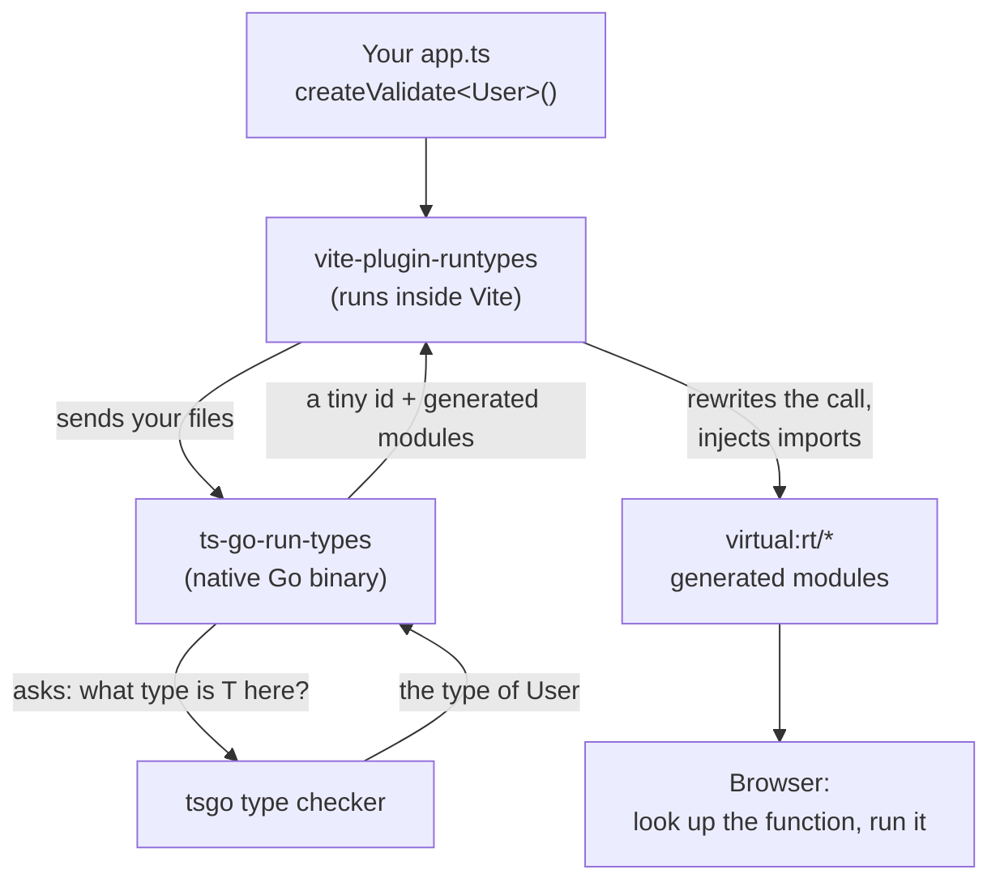

# How It Works

You write a normal TypeScript type. Somehow, at runtime, you get a validator, a JSON codec, a binary codec, mock data, or a stable id for that type. TypeScript erases types, so how?

Short version: all the clever stuff happens at **build time**. By the time your code runs, there's nothing left to figure out — it's just a lookup.

## Build time vs runtime

Two completely separate moments. Keep them apart in your head and the whole thing clicks.

**Build time** is where the magic lives. While Vite is bundling, a plugin reads your real TypeScript types straight from the compiler, turns each one into the function you asked for, and writes that function into the bundle.

**Runtime** is boring on purpose. Your `createValidate<User>()` call has already been handed the exact function it needs. No type checking, no reflection, no schema objects to build. It looks up a function and runs it. That's it.

The expensive thinking is paid once, on your machine, before you ship. Your users never pay it.

## The flow, end to end

Here's the whole trip a type takes, from the `.ts` file on your disk to a function in the browser.

::mermaid

::

Step by step:

1. **You call a factory.** `createValidate<User>()`, `getRunTypeId<Order>()`, `createJsonEncoder<Payload>()` — anything whose last parameter is the `InjectRunTypeId<T>` marker (more on that on the [side-channel page](/how-it-works/the-side-channel)).
2. **The plugin sends your file to the Go binary.** `vite-plugin-runtypes` runs inside Vite. The Go binary, `ts-go-run-types`, reads tsgo's actual type checker and answers: "what type is `T` at this exact call?"
3. **The binary generates code.** It resolves `User`, builds the function you asked for, and emits it as a small virtual module (`virtual:rt/…`).
4. **The plugin rewrites your call.** It drops a tiny id into the call and adds an import at the top of your file. Your source still reads the same — the rewrite is invisible in your editor, and real source maps mean breakpoints and stack traces land on your original lines.
5. **At runtime, it's a lookup.** The generated function is already in the bundle. Your call just grabs it and runs.

No part of this re-derives anything when your app runs. The browser never sees a type, a checker, or a schema.

## What ships to the browser

Less than you'd think.

- **The generated functions you actually called** — and only those. A file that asks for one validator ships one validator.
- **Tiny ids and imports** the plugin injected. Bytes, not kilobytes.
- **Zero runtime dependencies from the plugin.** `vite-plugin-runtypes` adds nothing to your runtime `node_modules`. The Go binary is a build-time tool; it never goes near the browser.

What does **not** ship: the type checker, the schemas, the reflection machinery, or any function you didn't use. Caches are demand-driven and every entry is its own module, so a file that only reflects an id ships zero validation code. (That's the [caches and tree-shaking page](/how-it-works/caches-and-tree-shaking).)

So: a Go binary does the heavy lifting at build time, and your runtime gets a handful of plain functions. Next, the bit people always ask about — [why a Go binary at all](/how-it-works/the-side-channel).
